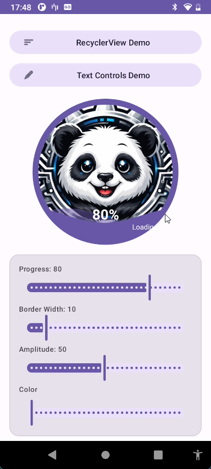
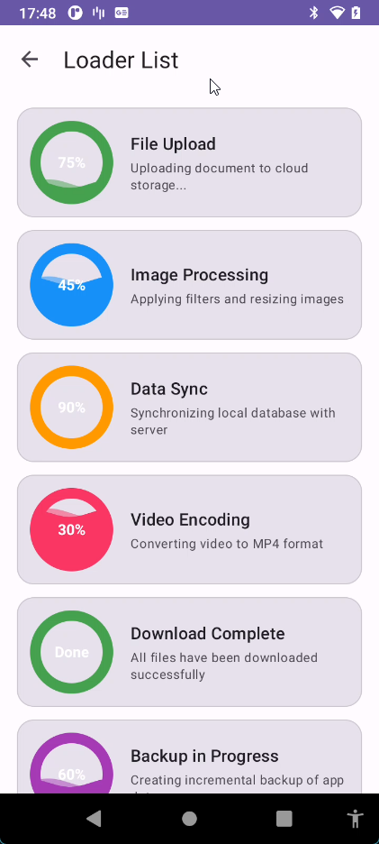

# KarSu CF Loaders

Circular Fillable Loader widget for Android with wave animation, text overlay, and extensive customization options.

A custom Android widget with rich text overlay, subtitle, auto-sizing, and shadow support.

## Screenshots

| Main Controls | Text Controls | RecyclerView |
|:---:|:---:|:---:|
|  |  |  |

https://github.com/kaplanerkan/KarSu-CF-Loader/raw/main/screenshots/scrcpy_jleYpcQWms.mp4

## Features

- Circular wave-fill animation with configurable speed and amplitude
- Image source support (with or without background image)
- Primary text overlay with font family, style, size, color, and positioning
- Subtitle text below primary text
- Auto progress percentage display with custom format
- Text shadow effects
- Auto-size text to fit within circle
- Border customization
- RecyclerView compatible with proper view recycling

## Modules

| Module | Description |
|--------|-------------|
| `karsu_cfl` | Library module - the `KarSuCfLoaders` custom widget |
| `karsu_cf_loader` | Sample app demonstrating all features |

## Sample App

The sample app contains three demo screens:

- **MainActivity** - Loader widget with interactive controls (progress, border width, wave amplitude, wave color)
- **TextControlsActivity** - Text overlay controls (text input, text size, position offsets, text color, progress toggle)
- **RecyclerViewActivity** - Demonstrates the widget inside a RecyclerView with 15 different configurations

## XML Attributes

### Core - Loader & Wave

| Attribute | Format | Default | Description |
|-----------|--------|---------|-------------|
| `cfl_progress` | integer | 0 | Fill level (0-100). Controls how much of the circle is filled with the wave. 0 = empty, 100 = full. The transition is animated with a decelerate effect. |
| `cfl_border` | boolean | true | Show or hide the circular border around the loader. |
| `cfl_border_width` | dimension | 10dp | Thickness of the circular border stroke. Set to 0 to remove the border completely. |
| `cfl_wave_color` | color | black | The color of the wave fill inside the circle. Accepts any color value (`#FF9800`, `?colorPrimary`, etc.). |
| `cfl_wave_amplitude` | float | 0.05 | Wave height ratio (0.0 - 0.05). Controls how "wavy" the surface is. Low values (0.001) create a calm, flat surface. High values (0.05) create visible waves. |
| `cfl_wave_enabled` | boolean | true | Enable or disable the wave animation. Disabling saves battery when animation is not needed. |
| `cfl_wave_speed` | integer | 1000 | Duration of one full wave cycle in milliseconds. Lower values = faster wave movement, higher values = slower, calmer wave. |

### Text - Primary Overlay

| Attribute | Format | Default | Description |
|-----------|--------|---------|-------------|
| `cfl_text` | string | null | Custom text displayed at the center of the circle. When set, this overrides the auto progress text. Set to null or empty to fall back to progress text. |
| `cfl_text_size` | dimension | 14sp | Font size of the primary text in sp or dp. |
| `cfl_text_color` | color | white | Color of the primary text. |
| `cfl_text_font_family` | string | default | Font family name (e.g., `sans-serif-medium`, `monospace`). Uses system default if not specified. |
| `cfl_text_style` | enum | normal | Text style: `normal`, `bold`, `italic`, or `bold_italic`. |
| `cfl_text_letter_spacing` | float | 0 | Letter spacing in ems. Positive values spread letters apart, negative values bring them closer. |
| `cfl_text_offset_x` | dimension | 0 | Horizontal offset from center. Positive = move right, negative = move left. Useful for fine-tuning text position. |
| `cfl_text_offset_y` | dimension | 0 | Vertical offset from center. Positive = move down, negative = move up. Use a large positive value (e.g., 80dp) to place text at the bottom of the circle. |
| `cfl_text_width_mode` | enum | wrap_content | `wrap_content` sizes text naturally. `match_parent` fills ~85% of circle diameter, useful for long text that should wrap within the circle. |
| `cfl_show_progress_text` | boolean | false | When true, automatically displays the current progress as a percentage (e.g., "80%"). Only shown when no custom text is set via `cfl_text`. |
| `cfl_progress_text_format` | string | "%d%%" | Format string for auto progress text. Must contain one integer placeholder. Example: `"%d%%"` produces "80%", `"Step %d"` produces "Step 80". |

### Subtitle

| Attribute | Format | Default | Description |
|-----------|--------|---------|-------------|
| `cfl_subtitle_text` | string | null | Secondary text displayed below the primary text. Useful for status messages like "Loading...", "Please wait", etc. |
| `cfl_subtitle_text_size` | dimension | 12sp | Font size of the subtitle. |
| `cfl_subtitle_text_color` | color | white | Color of the subtitle text. |
| `cfl_subtitle_font_family` | string | default | Font family for the subtitle. |
| `cfl_subtitle_text_style` | enum | normal | Subtitle text style: `normal`, `bold`, `italic`, or `bold_italic`. |
| `cfl_subtitle_offset_y` | dimension | 0 | Extra vertical gap between the primary text and subtitle. Positive values increase the spacing. |

### Text Shadow

| Attribute | Format | Default | Description |
|-----------|--------|---------|-------------|
| `cfl_text_shadow_color` | color | transparent | Shadow color. Set to a visible color (e.g., `#80000000` for semi-transparent black) to enable shadow. |
| `cfl_text_shadow_radius` | float | 0 | Shadow blur radius. Higher values create a softer, more spread-out shadow. Set to 0 to disable shadow. |
| `cfl_text_shadow_dx` | float | 0 | Horizontal shadow offset. Positive = shadow moves right. |
| `cfl_text_shadow_dy` | float | 0 | Vertical shadow offset. Positive = shadow moves down. |

### Auto-Size

| Attribute | Format | Default | Description |
|-----------|--------|---------|-------------|
| `cfl_auto_size_text` | boolean | false | When enabled, the text size is automatically reduced to fit within the circle. Useful when the text content is dynamic and might overflow. |
| `cfl_auto_size_min_text_size` | dimension | 8sp | Minimum text size when auto-sizing is active. Text will not be shrunk below this size even if it overflows. |

## Usage

```xml
<com.karsu.cfl.KarSuCfLoaders
    android:layout_width="200dp"
    android:layout_height="wrap_content"
    android:src="@drawable/your_image"
    app:cfl_progress="75"
    app:cfl_show_progress_text="true"
    app:cfl_text_color="@android:color/white"
    app:cfl_text_size="24sp"
    app:cfl_text_style="bold"
    app:cfl_wave_color="#4CAF50" />
```

## Acknowledgements

This project was inspired by [CircularFillableLoaders](https://github.com/lopspower/CircularFillableLoaders) by Mikhael Lopez. The original wave-fill concept served as a starting point, and the library was rewritten in Kotlin with significant enhancements including rich text overlay, subtitle support, auto-sizing, text shadow, and improved RecyclerView compatibility.

## Requirements

- Min SDK: 21 (Android 5.0)
- Target SDK: 36
- Kotlin / JVM 17

## License

MIT License - Copyright (c) 2026 Erkan Kaplan (KarSu)

See [LICENSE](LICENSE) for details.
